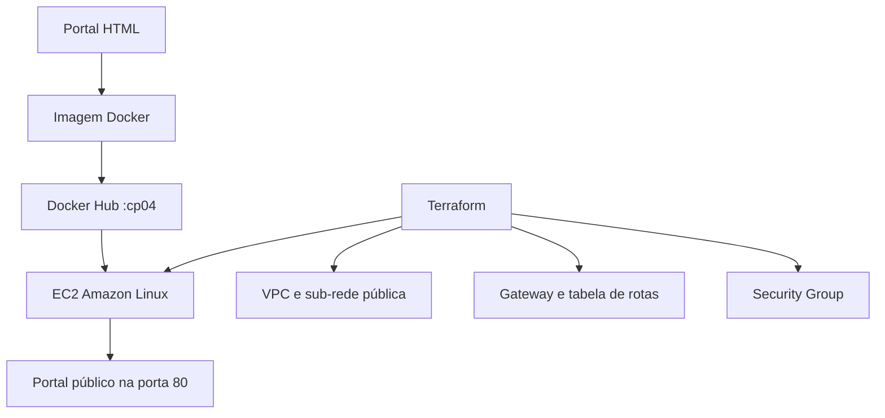

# CP04 - Containers na Nuvem

Projeto acadêmico da FIAP que demonstra a containerização de um portal estático, a publicação da imagem no Docker Hub com a tag `cp04` e a execução do container em uma instância EC2.

## Identificação

- **Aluno:** Guilherme Silva dos Santos
- **RM:** 551168
- **Turma:** 4ESPX

## Entregáveis atendidos

| Exigência | Implementação |
|---|---|
| Site personalizado | [`site/index.html`](site/index.html) |
| Nome, RM e turma | Cabeçalho do portal |
| Resumo sobre cgroups e namespaces | Seção principal do portal |
| Dockerfile funcional | [`Dockerfile`](Dockerfile) |
| Imagem pública com tag `cp04` | Workflow e instruções do Docker Hub |
| Container em uma EC2 | Infraestrutura em [`terraform/`](terraform/) |
| PDF com evidências | Roteiro em [`docs/EVIDENCIAS.md`](docs/EVIDENCIAS.md) |

> O PDF final deve ser gerado somente depois do deploy, pois precisa conter prints reais da imagem pública, da infraestrutura AWS e da URL funcionando.

## Arquitetura



O Terraform cria:

- VPC `10.0.0.0/24`;
- sub-rede pública com atribuição automática de IPv4;
- Internet Gateway;
- tabela de rotas com saída `0.0.0.0/0`;
- Security Group com HTTP na porta 80;
- SSH opcional, restrito a um CIDR informado;
- instância EC2 com Amazon Linux 2023;
- instalação do Docker por `user_data`;
- download e execução automática da imagem pública.

## Estrutura do projeto

```text
.
├── .github/workflows/
│   ├── docker-publish.yml
│   └── validate.yml
├── docs/
│   ├── EVIDENCIAS.md
│   ├── RELATORIO_MODELO.md
│   └── evidencias/
├── scripts/
│   ├── deploy.ps1
│   ├── deploy.sh
│   ├── destroy.ps1
│   ├── destroy.sh
│   └── verify-environment.ps1
├── site/index.html
├── terraform/
│   ├── templates/user_data.sh.tftpl
│   ├── ec2.tf
│   ├── networking.tf
│   ├── outputs.tf
│   ├── providers.tf
│   ├── security.tf
│   ├── terraform.tfvars.example
│   ├── variables.tf
│   └── versions.tf
├── compose.yaml
├── Dockerfile
└── README.md
```

## 1. Preparar o computador

Instale:

- Git;
- Docker Desktop;
- AWS CLI v2;
- Terraform.

No Windows PowerShell, verifique tudo com:

```powershell
Set-ExecutionPolicy -Scope Process Bypass
.\scripts\verify-environment.ps1
```

## 2. Testar o portal localmente

### Com Docker Compose

```powershell
docker compose up --build -d
```

Abra `http://localhost:8080`.

Para encerrar:

```powershell
docker compose down
```

### Somente com Docker

```powershell
docker build -t cp04-site:local .
docker run --rm -p 8080:80 cp04-site:local
```

## 3. Publicar no Docker Hub

Crie no Docker Hub um repositório público chamado `cp04-site`.

### Opção A - Pelo computador

Substitua `SEU_USUARIO_DOCKERHUB`:

```powershell
docker login
docker build -t SEU_USUARIO_DOCKERHUB/cp04-site:cp04 .
docker push SEU_USUARIO_DOCKERHUB/cp04-site:cp04
```

Confirme no Docker Hub que:

- o repositório está como **Public**;
- a tag exibida é exatamente **`cp04`**.

### Opção B - Pelo GitHub Actions

Crie dois secrets no repositório GitHub:

- `DOCKERHUB_USERNAME`;
- `DOCKERHUB_TOKEN`.

Depois, abra **Actions > Publicar no Docker Hub > Run workflow**. O workflow publicará:

```text
SEU_USUARIO_DOCKERHUB/cp04-site:cp04
```

Nunca utilize sua senha normal do Docker Hub como secret. Gere um access token exclusivo.

## 4. Preparar as credenciais do AWS Academy

Não inicie o laboratório antes de o site e a imagem Docker estarem prontos. Assim, o tempo da sessão acadêmica não é desperdiçado.

Quando estiver pronto para o deploy:

1. Abra o laboratório da AWS Academy indicado pelo professor.
2. Inicie a sessão do laboratório.
3. Aguarde o indicador ficar verde.
4. Procure **AWS Details**, **AWS CLI** ou **Show credentials**.
5. Copie o bloco de credenciais temporárias para o arquivo abaixo:

```text
%USERPROFILE%\.aws\credentials
```

Use um perfil separado:

```ini
[academy]
aws_access_key_id=VALOR_TEMPORARIO
aws_secret_access_key=VALOR_TEMPORARIO
aws_session_token=VALOR_TEMPORARIO
```

No arquivo `%USERPROFILE%\.aws\config`:

```ini
[profile academy]
region=us-east-1
output=json
```

Valide sem mostrar as chaves:

```powershell
aws sts get-caller-identity --profile academy
```

As credenciais da AWS Academy expiram. Quando isso acontecer, substitua os três valores pelo novo bloco do laboratório. Nunca salve credenciais dentro deste repositório.

### Se o laboratório não fornecer credenciais para CLI

Terraform precisa de credenciais programáticas. Se a tela do laboratório oferecer apenas o Console AWS e não oferecer `aws_access_key_id`, `aws_secret_access_key` e `aws_session_token`, utilize o roteiro manual ao final deste README.

## 5. Configurar o Terraform

Entre na pasta `terraform` e copie o arquivo de exemplo:

```powershell
Copy-Item .\terraform\terraform.tfvars.example .\terraform\terraform.tfvars
```

Edite `terraform/terraform.tfvars` e substitua:

```hcl
docker_image = "SEU_USUARIO_DOCKERHUB/cp04-site:cp04"
```

O arquivo real `terraform.tfvars` é ignorado pelo Git para evitar publicar configurações locais.

Por padrão, a porta 22 fica fechada. O `user_data` instala o Docker sem depender de SSH. Para habilitar SSH, informe um key pair já existente e somente o seu IP público com `/32`:

```hcl
key_name         = "nome-do-key-pair"
ssh_allowed_cidr = "SEU_IP_PUBLICO/32"
```

Nunca use `0.0.0.0/0` para SSH.

## 6. Criar a infraestrutura

Na raiz do projeto, execute:

```powershell
.\scripts\deploy.ps1 -Profile academy
```

O script executa:

1. validação das credenciais;
2. `terraform init`;
3. verificação de formatação;
4. `terraform validate`;
5. `terraform plan`;
6. `terraform apply` do plano revisado;
7. teste da URL pública.

Ao concluir, o Terraform apresenta informações como:

```text
instance_id = "i-..."
public_ip   = "..."
site_url    = "http://..."
```

O bootstrap da EC2 pode levar alguns minutos. O log fica em:

```text
/var/log/cp04-bootstrap.log
```

## 7. Registrar as evidências

Siga o checklist completo de [`docs/EVIDENCIAS.md`](docs/EVIDENCIAS.md). Os prints devem mostrar informações reais e legíveis:

- página personalizada;
- build da imagem;
- tag `cp04` pública no Docker Hub;
- VPC e rede;
- Security Group;
- EC2 em execução;
- URL pública funcionando.

Use [`docs/RELATORIO_MODELO.md`](docs/RELATORIO_MODELO.md) como base para o PDF.

## 8. Remover os recursos

Depois de salvar todas as evidências:

```powershell
.\scripts\destroy.ps1 -Profile academy
```

O script exige que você digite `DESTRUIR` antes de remover os recursos.

Confirme no Console AWS que a EC2 foi terminada. Essa etapa evita consumo desnecessário do orçamento acadêmico.

## Roteiro manual de contingência

Use este caminho somente se o laboratório não fornecer credenciais para Terraform:

1. Crie uma VPC com CIDR `10.0.0.0/24`.
2. Crie uma sub-rede dentro da VPC e habilite IPv4 público automático.
3. Crie um Internet Gateway e conecte-o à VPC.
4. Crie uma tabela de rotas.
5. Adicione `0.0.0.0/0` apontando para o Internet Gateway.
6. Associe a tabela de rotas à sub-rede.
7. Crie um Security Group com TCP 80 para `0.0.0.0/0`.
8. Abra SSH somente para o seu IP se realmente precisar.
9. Inicie uma EC2 Amazon Linux 2023 com IP público.
10. Cole o conteúdo adaptado de `terraform/templates/user_data.sh.tftpl` em **User data**.
11. Substitua a variável da imagem pelo endereço real do Docker Hub.
12. Aguarde a inicialização e abra `http://IP_PUBLICO`.

## Segurança

Leia [`SECURITY.md`](SECURITY.md) antes de configurar AWS, GitHub ou Docker Hub.

## Referências técnicas

- [Docker: construir uma imagem](https://docs.docker.com/build/building/packaging/)
- [Docker: publicar uma imagem](https://docs.docker.com/reference/cli/docker/image/push/)
- [Terraform: infraestrutura AWS](https://developer.hashicorp.com/terraform/tutorials/aws-get-started/aws-create)
- [AWS CLI: credenciais temporárias](https://docs.aws.amazon.com/cli/latest/userguide/cli-authentication-short-term.html)
